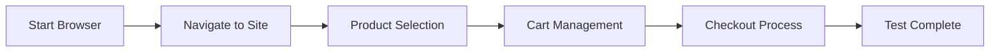

# 🚀 Selenium MCP Server Demo

## 📝 Project Overview
This project demonstrates the power of natural language automation using Selenium MCP Server, where complex browser interactions are simplified into plain English commands.

## 🎯 The Magic Prompt
Here's the single prompt that drives the entire automation:

```
use selenium mcp server visit https://www.demoblaze.com/ select Samsung galaxy s6 product add to the cart and checkout
```

## 🔄 How It Works
1. 🤖 **MCP Server Magic**
   - Translates natural language into browser automation
   - Handles complex interactions automatically
   - Manages timing and synchronization

2. 🌐 **Browser Interaction Flow**


3. ⚡ **Key Features**
   - Natural language test creation
   - Automatic element detection
   - Smart waiting mechanisms
   - Alert handling
   - Form interactions

## 🎥 Test Scenario
```plaintext
Browser Launch
    ↓
Visit DemoBlaze
    ↓
Select Product
    ↓
Add to Cart
    ↓
Checkout Process
    ↓
Verification
```

## 💡 Benefits
- 📝 No need to write complex locator strategies
- ⏱️ Automatic timing handling
- 🔄 Built-in alert management
- 🎯 Natural language processing
- 🚀 Quick test creation

## 🛠️ Tech Stack
- Java 21
- Selenium WebDriver
- TestNG
- Maven
- WebDriverManager
- Selenium MCP Server

## 🏃‍♂️ Running the Tests
Simply use this natural language prompt in VS Code with Selenium MCP Server enabled:
```
use selenium mcp server visit https://www.demoblaze.com/ select Samsung galaxy s6 product add to the cart and checkout
```
That's it! The MCP server will automatically handle the browser automation based on your natural language command.

## 🎉 Results
The test automates an entire e-commerce flow with a single English prompt, demonstrating the power of natural language test automation.

---
Created with ❤️ using Selenium MCP Server