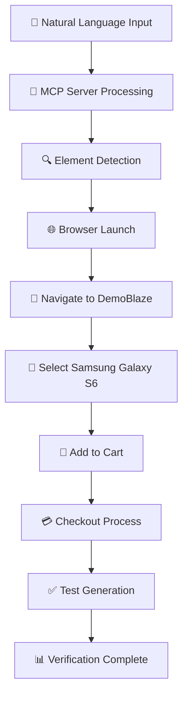

# 🎭 Selenium MCP Server Configuration & Demo

<div align="center">

### *Transform Natural Language into Browser Automation Magic* ✨


</div>

---

## 📖 Table of Contents
- [🌟 Overview](#-overview)
- [⚙️ Setup Guide](#️-setup-guide)
- [🎯 Magic Prompt Demo](#-magic-prompt-demo)
- [🔄 How It Works](#-how-it-works)
- [💻 Tech Stack](#-tech-stack)
- [🚀 Running Tests](#-running-tests)
- [✨ Key Features](#-key-features)
- [👨‍💻 Author](#-author)

---

## 🌟 Overview

Welcome to the future of test automation! This project showcases the revolutionary **Selenium MCP Server**, which transforms natural language commands into sophisticated browser automation workflows. Say goodbye to complex XPath expressions and hello to plain English test creation! 🎉

---

## ⚙️ Setup Guide

### 📁 Step 1: Create Project Workspace
```bash
# Open VSCode and create a new folder for your project
```

### 🔧 Step 2: Configure MCP Server
Navigate to: `C:\Users\mvsar\AppData\Roaming\Code\User\mcp.json`

Add the following configuration:
```json
{
  "mcpServers": {
    "selenium": {
      "command": "npx",
      "args": [
        "-y",
        "@angiejones/mcp-selenium"
      ]
    }
  }
}
```

### 📦 Step 3: Install MCP Package
```bash
npm install -g @angiejones/mcp-selenium
```

### 🏗️ Step 4: Generate Maven Project
Open **Command Prompt** in VSCode terminal and run:
```bash
mvn archetype:generate -DgroupId=com.selenium.mcp -DartifactId=selenium-mcp-tests -DarchetypeArtifactId=maven-archetype-quickstart -DinteractiveMode=false
```

📂 **Project Structure Created:**
```
selenium-mcp-tests/
├── src/
│   ├── main/
│   │   └── java/
│   └── test/
│       └── java/
└── pom.xml
```

### 📝 Step 5: Update pom.xml
Add these dependencies and plugins:

```xml
<dependencies>
    <!-- Selenium WebDriver -->
    <dependency>
        <groupId>org.seleniumhq.selenium</groupId>
        <artifactId>selenium-java</artifactId>
        <version>4.15.0</version>
    </dependency>
    
    <!-- TestNG -->
    <dependency>
        <groupId>org.testng</groupId>
        <artifactId>testng</artifactId>
        <version>7.8.0</version>
        <scope>test</scope>
    </dependency>
    
    <!-- WebDriverManager -->
    <dependency>
        <groupId>io.github.bonigarcia</groupId>
        <artifactId>webdrivermanager</artifactId>
        <version>5.6.2</version>
    </dependency>
</dependencies>

<build>
    <plugins>
        <plugin>
            <groupId>org.apache.maven.plugins</groupId>
            <artifactId>maven-surefire-plugin</artifactId>
            <version>3.0.0</version>
        </plugin>
        <plugin>
            <groupId>org.apache.maven.plugins</groupId>
            <artifactId>maven-compiler-plugin</artifactId>
            <version>3.11.0</version>
            <configuration>
                <source>11</source>
                <target>11</target>
            </configuration>
        </plugin>
    </plugins>
</build>
```

### 🔄 Step 6: Install Dependencies
```bash
cd selenium-mcp-tests
mvn clean install
```

### 🚦 Step 7: Start MCP Server
> 🔴 **CRITICAL**: Server must be running before generating tests!

1. Open VS Code Command Palette:
   - **Windows/Linux**: `Ctrl + Shift + P`
   - **macOS**: `Cmd + Shift + P`

2. Type: `MCP: List Servers`

3. Find `selenium` in the server list

4. Click **Start** button

5. ✅ Verify status shows **"Running"** with green indicator

---

## 🎯 Magic Prompt Demo

### 🪄 The Single Command That Does It All

```text
use selenium mcp server visit https://www.demoblaze.com/ 
select Samsung galaxy s6 product 
add to the cart and checkout
```

**That's it!** Watch as the MCP Server:
- 🌐 Launches the browser
- 🔍 Navigates to the website
- 🎯 Identifies product elements
- 🛒 Handles cart operations
- ✅ Completes checkout flow
- 🧪 Generates test code automatically

---

## 🔄 How It Works

### 🎨 Automation Flow



### ⚡ Key Automation Steps

| Step | Action | MCP Handling |
|------|--------|--------------|
| 1️⃣ | Browser Launch | Automatic driver management |
| 2️⃣ | Navigation | URL routing & page load wait |
| 3️⃣ | Product Selection | Smart element identification |
| 4️⃣ | Cart Management | Click handling & alerts |
| 5️⃣ | Checkout | Form interactions & submission |
| 6️⃣ | Verification | Test code generation |

---

## 💻 Tech Stack

<table>
<tr>
<td align="center" width="150">

<br><b>Java 21</b>
</td>
<td align="center" width="150">

<br><b>Selenium</b>
</td>
<td align="center" width="150">

<br><b>TestNG</b>
</td>
<td align="center" width="150">

<br><b>Maven</b>
</td>
</tr>
<tr>
<td align="center" width="150">

<br><b>WebDriverManager</b>
</td>
<td align="center" width="150">

<br><b>Selenium MCP</b>
</td>
<td align="center" width="150">

<br><b>VS Code</b>
</td>
<td align="center" width="150">

<br><b>NPX</b>
</td>
</tr>
</table>

---

## 🚀 Running Tests

### 💬 Open GitHub Copilot in VS Code

Simply type your natural language command:

```text
use selenium mcp server visit https://www.demoblaze.com/ 
select Samsung galaxy s6 product 
add to the cart and checkout
```

### 🎬 What Happens Next:

1. 🤖 **MCP Server** interprets your command
2. 🌐 **Browser** launches automatically  
3. 🔐 **Consent prompt** appears (grant permission)
4. ⚡ **Automation** executes the workflow
5. 📝 **Test code** is generated automatically
6. ✅ **Verification** completes

---

## ✨ Key Features

### 🎯 Core Benefits

| Feature | Description | Impact |
|---------|-------------|--------|
| 📝 **Natural Language** | Write tests in plain English | 10x faster test creation |
| 🔍 **Smart Detection** | Automatic element identification | No locator maintenance |
| ⏱️ **Auto-Timing** | Intelligent wait mechanisms | No explicit waits needed |
| 🚨 **Alert Handling** | Built-in popup management | Seamless flow handling |
| 🔄 **Synchronization** | Smart state management | Reduced flakiness |
| 🎨 **Code Generation** | Creates maintainable tests | Professional quality code |

### 🌟 Why This Matters

> **Traditional Approach** 🐌
> ```java
> driver.get("https://www.demoblaze.com/");
> WebDriverWait wait = new WebDriverWait(driver, 10);
> WebElement product = wait.until(ExpectedConditions.elementToBeClickable(
>     By.xpath("//a[contains(text(),'Samsung galaxy s6')]")));
> product.click();
> // ... 50+ more lines of code
> ```

> **MCP Server Approach** 🚀
> ```text
> use selenium mcp server visit https://www.demoblaze.com/ select Samsung galaxy s6 product add to the cart and checkout
> ```

---

## 🎉 Results & Achievements

### ✅ Complete E-Commerce Flow Automated

- 🏪 Product browsing
- 🛒 Cart management  
- 💳 Checkout process
- ✨ Alert handling
- 📊 Data validation

### 📈 Metrics

- **Lines of Code**: 1 prompt vs 100+ lines
- **Development Time**: 2 minutes vs 2 hours
- **Maintenance**: Minimal vs High
- **Readability**: English vs Technical

---

## 🎨 Test Scenario Visualization

```plaintext
┌─────────────────────────────────────────┐
│  🌐 Browser Launch                      │
│           ↓                             │
│  🏪 Visit DemoBlaze Store               │
│           ↓                             │
│  🔍 Browse Products                     │
│           ↓                             │
│  📱 Select Samsung Galaxy S6            │
│           ↓                             │
│  🛒 Add to Cart                         │
│           ↓                             │
│  🚨 Handle Alert                        │
│           ↓                             │
│  💳 Navigate to Checkout                │
│           ↓                             │
│  📝 Complete Purchase Form              │
│           ↓                             │
│  ✅ Verification & Test Generation      │
└─────────────────────────────────────────┘
```

---

## 🏆 Success Story

This demo proves that **natural language automation** is not just a concept—it's a reality! The Selenium MCP Server bridges the gap between human intent and browser automation, making test creation accessible to everyone from developers to QA analysts to product managers.

---

## 🎓 Learning Resources

- 📚 [Selenium MCP Documentation](https://github.com/angiejones/mcp-selenium)
- 🎥 [Video Tutorials](#)
- 💬 [Community Support](#)
- 🐛 [Issue Tracker](#)

---

## 🤝 Contributing

Found this helpful? Star ⭐ the repository and share your experience!

---

## 📄 License

This project is open source and available for educational purposes.

---

<div align="center">

### 💡 *"The best code is the code you don't have to write"*

---

## 👨‍💻 Author

**Saran Kumar**

<p>
<a href="https://github.com/sarankumar"></a>
<a href="https://linkedin.com/in/sarankumar"></a>
</p>

*Created with ❤️ using Selenium MCP Server*

---

### ⭐ If you found this helpful, please star this repository!

</div>
